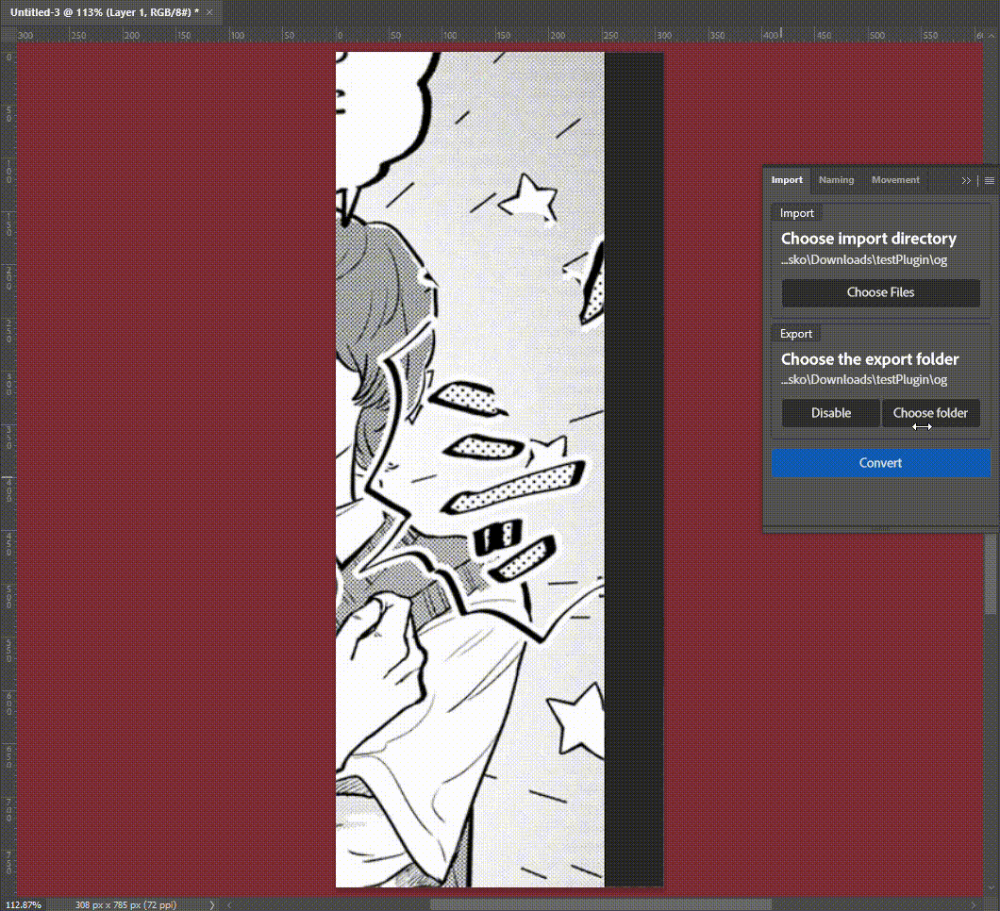

# Plugin guide

---

## Importing files

Open the **Import Panel**. Navigate to the Import section of the panel and click the `Choose Files`. Click the button
and a file modal will open up. Pick all the files you want to work on. After you are done, you should be able to see
all the files in the **Movement Panel** in the Files section.

## Exporting files

Upon importing files, the export folder is automatically set to be the import folder if the export folder
wasn't set before. If it was set before, it will not change. Depending on your plugin settings, the files will want
to get saved after opening or only when you press the ***Save button***. In either case, they will end up saving
to this folder.

You can disable saving completely by clicking the ***Disable button***. To enable it again, just click the ***Enable button***.

## Converting files

Upon importing files, you can choose to convert them to one of a few different file types. Click the ***Convert button***.

This will create a popup which will ask you for a folder into which to export the converted files as well as what
extension you would like to use for the files. This conversion works for any files that can be imported using the 
plugin!

## Naming files

Naming might seem confusing at first, but once you understand it, you will realize just how powerful it is. Navigate to the Naming panel.

The top section of the naming panel is responsible for naming of each page. Feel free to click the ***Guide button*** to get closer instructions.
I will explain the instruction here as well just in case.

The text you write will be applied to each page. This is a template text. If you use some of the special sequences of characters as can be seen in the ***Guide***
part, each page will have different information in the text. For example, the page number can change between pages. So, you can use the `%num%` anywhere in the text
and it will automatically be replaced with the page number of each page when saving. Same goes for all the other parts.

If you're unsure how the final name will look, you can always go underneath the Movement panel and check the "Current file name" part to see the name of the current
page. There is also a preview of the page naming on the naming panel.

You can also save your template strings in the lower section. Just click the ***Save Preset button***. You can then load it by going in the lower section, picking
it out of the dropdown menu and clicking ***Load***. If you feel like you have way too many templates, you can also just press delete after you have selected
your template.

## Movement

If you have imported files, you can go to the Movement panel.

The top section is responsible for moving between files. Upon clicking ***Start***, the first file will load. You can use the arrows to go to next or previous
pages. You can also double click a file in the list to go to a specific file. Clicking complete will mark that file as complete. This changes nothing except for the
fact that it is marked as complete. Maybe this can be used to let YOU know which files you completed. You can also press the ***Save button***, which saves the current
file using the template string that was written in the Naming panel. If there is nothing written, it will use the original file name instead. If you want the files
to automatically save, you need to visit the Plugin settings.

You can also adjust the current page number and it will automatically adjust the page numbers after. It's right underneath the movement panel.

## Saving projects for later

Now, most projects don't take just one session to finish. So, in order to not redo the setup from last time, you can save your projects.

At the bottom of the Movement panel, there are all the settings you need for this. Start by pressing save. This will create a new modal window.
Here, just write the name of the project and click save. Later, if you want to load the project, just open up the pop up menu and click load. All the settings
will be automatically put back to what they were before you saved. This doesn't include the template string which will have to be saved individually.

You can also delete the projects by pressing delete instead of load.

## Changing plugin settings

If there are some settings that you would like to change, you can go underneath: Plugins -> Page Manager -> Plugin Settings.

Adjust them however you like. There is always an explanation of what is changed.

## Errors

It is possible that you got some errors while working on something. While this plugin strives to be perfect, accidents happen. Now, you have
several options.
1. Ignore it
2. Let the author know about the error so it's fixed later

If you chose the second option, you can go underneath: Plugins -> PageManager -> Plugin Info. Click the ***Open Data Folder*** at the bottom and navigate to the
`logs` folder. Take your current day and find the log for it. You can put this file underneath issues on github, or message me the file along with explanation
of when it happend and what you were doing on discord. My discord name is m3mber.